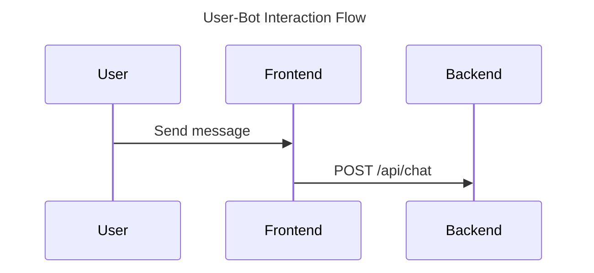

# 🎨 UI Mockups - BotInterface

Guide complet pour créer et gérer les maquettes d'interface utilisateur du projet BotInterface.

## 📋 Table des matières

- [🎯 Introduction](#-introduction)
- [🛠️ Outils recommandés](#️-outils-recommandés)
- [📐 Processus de création](#-processus-de-création)
- [🎨 Design System](#-design-system)
- [📱 Maquettes à créer](#-maquettes-à-créer)
- [✅ Checklist de validation](#-checklist-de-validation)
- [📂 Organisation des fichiers](#-organisation-des-fichiers)
- [💡 Bonnes pratiques](#-bonnes-pratiques)

## 🎯 Introduction

Ce dossier contient toutes les maquettes d'interface utilisateur (UI mockups) pour l'application BotInterface. Les mockups servent de référence visuelle pour le développement frontend et assurent une cohérence dans l'expérience utilisateur.

## 🛠️ Outils recommandés

### Outil principal : GitHub Copilot ⭐

Pour ce projet, nous utiliserons **GitHub Copilot** pour générer les mockups et diagrammes :

1. **GitHub Copilot pour les mockups SVG**
   - Génération de code SVG directement dans VS Code
   - Mockups vectoriels et scalables
   - Facilement modifiables et versionnés avec Git
   - Prévisualisation directe dans l'éditeur
   - Léger et performant

2. **Mermaid pour les diagrammes (.mmd)**
   - Diagrammes as code (version control friendly)
   - Syntaxe simple et lisible
   - Intégration native GitHub/VS Code
   - Génération automatique de visuels
   - Parfait pour wireframes et flux

### Pourquoi SVG + Mermaid ?

✅ **Version control** : Fichiers texte faciles à diff et merger
✅ **Collaboration** : Modifications traçables dans Git
✅ **Légèreté** : Pas de gros fichiers binaires
✅ **Scalabilité** : SVG vectoriel, toujours net
✅ **Accessibilité** : Éditable dans n'importe quel éditeur de texte
✅ **CI/CD friendly** : Génération automatique possible
✅ **Documentation** : Code auto-documenté

### Outils complémentaires (optionnels)

- **[SVG Preview Extension](https://marketplace.visualstudio.com/items?itemName=SimonSiefke.svg-preview)** - Prévisualisation SVG dans VS Code
- **[Mermaid Preview](https://marketplace.visualstudio.com/items?itemName=vstirbu.vscode-mermaid-preview)** - Prévisualisation Mermaid
- **[SVGO](https://github.com/svg/svgo)** - Optimisation SVG
- **[Figma](https://www.figma.com/)** (optionnel) - Pour inspiration ou référence visuelle

## 📐 Processus de création

### Étape 1 : Wireframes avec Mermaid (.mmd)

Créez d'abord des diagrammes Mermaid pour définir la structure et les flux :

```
1. Créer des flowcharts pour les parcours utilisateur
2. Définir la hiérarchie avec des diagrammes de blocs
3. Mapper les interactions avec des sequence diagrams
4. Documenter les composants avec des class diagrams
```

**Commande GitHub Copilot :**
```
"Crée un diagramme Mermaid flowchart pour une interface de chat avec header, zone de messages et input"
```

**Fichiers :** `*.mmd` dans `wireframes/`

### Étape 2 : Mockups SVG basse fidélité

Générez des mockups SVG simples pour visualiser la structure :

```
1. Demander à Copilot de générer le layout de base
2. Définir les zones principales (rectangles, formes)
3. Ajouter les proportions et espacements
4. Créer les variations (desktop, tablette, mobile)
```

**Commande GitHub Copilot :**
```
"Génère un mockup SVG d'une interface de chat responsive avec header 60px, zone de messages scrollable et input fixe en bas"
```

**Fichiers :** `*.svg` dans `wireframes/`

### Étape 3 : Mockups SVG haute fidélité

Affinez les mockups avec plus de détails visuels :

```
1. Ajouter les couleurs du design system
2. Intégrer la typographie et les textes
3. Inclure les icônes et boutons détaillés
4. Créer les différents états (hover, active, disabled)
5. Designer les micro-interactions avec animations SVG
```

**Commande GitHub Copilot :**
```
"Améliore ce mockup SVG en ajoutant la palette de couleurs (#007bff, #6c757d), des ombres portées et des boutons stylisés"
```

**Fichiers :** `*.svg` dans `mockups/`

### Étape 4 : Diagrammes d'interaction Mermaid

Documentez les interactions et états avec Mermaid :

```
1. Créer des sequence diagrams pour les flux d'interaction
2. Documenter les états avec state diagrams
3. Définir les parcours avec user journey diagrams
4. Mapper les cas d'usage
```

**Commande GitHub Copilot :**
```
"Crée un sequence diagram Mermaid montrant l'interaction utilisateur-bot : envoi message, loading, réponse"
```

**Fichiers :** `*.mmd` dans `interactions/`

### Étape 5 : Documentation et optimisation

Préparez les assets finaux :

```
1. Optimiser les SVG avec SVGO
2. Créer un index.md listant tous les mockups
3. Documenter les spécifications dans des commentaires SVG
4. Générer des aperçus PNG si nécessaire
5. Commit et versioning Git
```

## 🎨 Design System

### Palette de couleurs

Définissez votre palette de couleurs principale :

```css
/* Couleurs principales */
--primary-color: #007bff;      /* Bleu principal */
--secondary-color: #6c757d;    /* Gris secondaire */
--accent-color: #28a745;       /* Vert accent */

/* Couleurs de fond */
--bg-primary: #ffffff;         /* Fond blanc */
--bg-secondary: #f8f9fa;       /* Fond gris clair */
--bg-dark: #212529;           /* Fond sombre */

/* Couleurs de texte */
--text-primary: #212529;       /* Texte principal */
--text-secondary: #6c757d;     /* Texte secondaire */
--text-light: #ffffff;         /* Texte clair */

/* Couleurs d'état */
--success: #28a745;            /* Succès */
--warning: #ffc107;            /* Avertissement */
--error: #dc3545;              /* Erreur */
--info: #17a2b8;               /* Information */
```

### Typographie

```css
/* Polices */
--font-primary: 'Inter', -apple-system, BlinkMacSystemFont, 'Segoe UI', sans-serif;
--font-mono: 'Fira Code', 'Courier New', monospace;

/* Tailles */
--text-xs: 0.75rem;    /* 12px */
--text-sm: 0.875rem;   /* 14px */
--text-base: 1rem;     /* 16px */
--text-lg: 1.125rem;   /* 18px */
--text-xl: 1.25rem;    /* 20px */
--text-2xl: 1.5rem;    /* 24px */
--text-3xl: 1.875rem;  /* 30px */
--text-4xl: 2.25rem;   /* 36px */
```

### Espacements

```css
/* Grille de 8px */
--spacing-xs: 0.25rem;   /* 4px */
--spacing-sm: 0.5rem;    /* 8px */
--spacing-md: 1rem;      /* 16px */
--spacing-lg: 1.5rem;    /* 24px */
--spacing-xl: 2rem;      /* 32px */
--spacing-2xl: 3rem;     /* 48px */
--spacing-3xl: 4rem;     /* 64px */
```

### Composants

- **Boutons** : 3 tailles (small, medium, large), 3 variantes (primary, secondary, outline)
- **Inputs** : Champs de texte, textarea, avec états (normal, focus, error)
- **Cards** : Pour afficher les messages du chat
- **Headers** : Barre de navigation et titre
- **Loaders** : Indicateurs de chargement

## 📱 Maquettes à créer

### Vue principale - Interface de chat

**Desktop (1920x1080)**
- [ ] État initial (aucun message)
- [ ] État avec historique de conversation
- [ ] État de chargement (bot en train de répondre)
- [ ] État d'erreur

**Tablette (768x1024)**
- [ ] Layout adapté
- [ ] Navigation optimisée

**Mobile (375x667)**
- [ ] Interface responsive
- [ ] Menu hamburger
- [ ] Clavier virtuel visible

### Composants individuels

- [ ] Message utilisateur
- [ ] Message bot
- [ ] Zone de saisie avec bouton d'envoi
- [ ] Header avec logo et navigation
- [ ] Sidebar (historique des conversations)
- [ ] Modal de paramètres
- [ ] Toast notifications

### États interactifs

- [ ] Hover states (survol des boutons)
- [ ] Focus states (champs actifs)
- [ ] Active states (bouton pressé)
- [ ] Disabled states (éléments désactivés)
- [ ] Loading states (chargement en cours)
- [ ] Error states (messages d'erreur)

### Dark mode

- [ ] Version sombre de toutes les vues
- [ ] Toggle dark/light mode

## ✅ Checklist de validation

Avant de valider un mockup, vérifiez :

- [ ] **Responsive** : Fonctionne sur desktop, tablette et mobile
- [ ] **Accessibilité** : Contrastes suffisants (WCAG AA minimum)
- [ ] **Cohérence** : Respecte le design system
- [ ] **Utilisabilité** : Navigation intuitive et claire
- [ ] **Performance** : Images optimisées, chargement rapide
- [ ] **États** : Tous les états interactifs sont définis
- [ ] **Feedback** : L'utilisateur sait toujours ce qui se passe
- [ ] **Alignement** : Grille respectée, éléments alignés
- [ ] **Hiérarchie** : Information structurée et lisible
- [ ] **Micro-interactions** : Animations définies

## 📂 Organisation des fichiers

Structure recommandée pour ce dossier :

```
ui-mockups/
│
├── README.md                    # Ce fichier
│
├── wireframes/                  # Wireframes et diagrammes
│   ├── flows/
│   │   ├── user-flow.mmd       # Flux utilisateur (Mermaid)
│   │   └── navigation.mmd      # Navigation (Mermaid)
│   ├── desktop/
│   │   ├── layout-basic.svg    # Layout desktop basique
│   │   └── layout-detailed.svg # Layout desktop détaillé
│   ├── tablet/
│   │   └── layout-basic.svg
│   └── mobile/
│       └── layout-basic.svg
│
├── mockups/                     # Mockups haute fidélité SVG
│   ├── desktop/
│   │   ├── home-empty.svg      # État initial
│   │   ├── home-with-chat.svg  # Avec conversation
│   │   ├── home-loading.svg    # Chargement
│   │   └── home-error.svg      # État d'erreur
│   ├── tablet/
│   │   ├── home-empty.svg
│   │   └── home-with-chat.svg
│   └── mobile/
│       ├── home-empty.svg
│       ├── home-with-chat.svg
│       └── home-keyboard.svg   # Avec clavier virtuel
│
├── components/                  # Composants individuels SVG
│   ├── buttons.svg             # Bibliothèque de boutons
│   ├── inputs.svg              # Champs de saisie
│   ├── message-cards.svg       # Cartes de messages
│   ├── header.svg              # En-tête
│   └── icons.svg               # Icônes du projet
│
├── interactions/               # Diagrammes d'interaction Mermaid
│   ├── user-bot-sequence.mmd  # Séquence user-bot
│   ├── states.mmd             # Diagramme d'états
│   └── user-journey.mmd       # Parcours utilisateur
│
├── design-system/              # Guide de style
│   ├── colors.svg             # Palette de couleurs
│   ├── typography.svg         # Typographie
│   ├── spacing.svg            # Grille d'espacement
│   └── design-tokens.md       # Tokens de design
│
├── dark-mode/                  # Versions dark mode
│   ├── home-dark.svg
│   └── components-dark.svg
│
└── exports/                    # Assets générés (optionnel)
    ├── png/                   # Conversions PNG pour présentation
    │   ├── desktop-home.png
    │   └── mobile-home.png
    └── optimized/             # SVG optimisés pour production
        └── *.svg
```

## 💡 Bonnes pratiques

### 1. Nommage des fichiers

Utilisez une convention claire et cohérente :

**Pour les SVG :**
```
[device]-[page]-[state]-[version].svg

Exemples :
- desktop-home-empty-v1.svg
- mobile-chat-loading-v2.svg
- tablet-settings-open-v1.svg
- component-button-primary.svg
```

**Pour les Mermaid :**
```
[type]-[description].mmd

Exemples :
- flow-user-login.mmd
- sequence-chat-interaction.mmd
- state-message-lifecycle.mmd
- journey-user-experience.mmd
```

### 2. Structure SVG

**Bonnes pratiques pour les SVG générés :**

```svg
<!-- Toujours inclure viewBox pour la scalabilité -->
<svg viewBox="0 0 1920 1080" xmlns="http://www.w3.org/2000/svg">
  
  <!-- Utiliser des groupes pour organiser -->
  <g id="header">
    <!-- Éléments du header -->
  </g>
  
  <g id="chat-area">
    <!-- Zone de messages -->
  </g>
  
  <g id="input-area">
    <!-- Zone de saisie -->
  </g>
  
  <!-- Définir les styles dans <defs> -->
  <defs>
    <style>
      .primary-btn { fill: #007bff; }
      .text { font-family: Inter, sans-serif; }
    </style>
  </defs>
</svg>
```

### 3. Prompts GitHub Copilot efficaces

**Pour les mockups SVG :**
```
✅ BON : "Crée un mockup SVG 1920x1080 d'une interface de chat avec header bleu (#007bff) 60px, zone de messages scrollable avec 3 messages exemples, et input fixe en bas avec bouton d'envoi"

❌ MAUVAIS : "Fais un mockup de chat"
```

**Pour les diagrammes Mermaid :**
```
✅ BON : "Génère un sequence diagram Mermaid montrant : 1) User envoie message, 2) Frontend affiche loading, 3) Backend appelle Bot API, 4) Bot répond, 5) Frontend affiche réponse"

❌ MAUVAIS : "Diagramme de chat"
```

**Astuces :**
- Soyez spécifique sur les dimensions et couleurs
- Mentionnez le design system existant
- Décrivez les états et interactions
- Référencez d'autres mockups pour cohérence

### 4. Optimisation SVG

Après génération, optimisez vos SVG :

```powershell
# Installer SVGO globalement
npm install -g svgo

# Optimiser un fichier
svgo mockup.svg -o mockup-optimized.svg

# Optimiser un dossier
svgo -f ./mockups -o ./exports/optimized
```

**Optimisations manuelles :**
- Supprimer les métadonnées inutiles
- Simplifier les paths
- Utiliser des définitions réutilisables (<defs>)
- Regrouper les éléments similaires

### 5. Versioning Git

**Commiter régulièrement :**
```powershell
git add docs/ui-mockups/
git commit -m "feat(ui): add desktop home mockup with chat states"
git push
```

**Messages de commit pour mockups :**
- `feat(ui): add [device] [page] mockup`
- `update(ui): refine [component] colors`
- `fix(ui): correct [element] spacing`
- `docs(ui): add [diagram] for [flow]`

### 6. Documentation dans les fichiers

**Ajouter des commentaires dans SVG :**
```svg
<svg viewBox="0 0 1920 1080">
  <!-- Header Section - Height: 60px, Background: #007bff -->
  <g id="header">
    <!-- Logo: 40x40px, Position: 20px from left -->
    <rect x="20" y="10" width="40" height="40" fill="#fff"/>
  </g>
</svg>
```

**Ajouter des métadonnées dans Mermaid :**


### 7. Prévisualisation

**Dans VS Code :**
- Installer "SVG Preview" extension
- Clic droit sur fichier SVG → "Open Preview"
- Ou utiliser `Ctrl+K V` (preview side-by-side)

**Pour Mermaid :**
- Installer "Mermaid Preview" extension  
- Ou prévisualiser sur [Mermaid Live Editor](https://mermaid.live/)
- GitHub affiche automatiquement les .mmd dans README

### 8. Réutilisabilité

**Créer des composants SVG réutilisables :**
```svg
<!-- components/button.svg -->
<svg id="primary-button">
  <rect rx="4" width="120" height="40" fill="#007bff"/>
  <text x="60" y="25" text-anchor="middle" fill="white">Envoyer</text>
</svg>

<!-- Réutiliser dans mockup -->
<use href="components/button.svg#primary-button" x="100" y="500"/>
```

### 9. Accessibilité SVG

```svg
<svg role="img" aria-labelledby="title desc">
  <title id="title">Interface de chat BotInterface</title>
  <desc id="desc">Mockup montrant l'interface avec header, messages et input</desc>
  <!-- Contenu -->
</svg>
```

## 📚 Ressources utiles

### GitHub Copilot - Prompts et astuces

**Templates de prompts pour mockups :**
```
"Crée un mockup SVG [device] ([dimensions]) pour [page] avec [éléments] utilisant les couleurs [palette]"

"Génère un composant SVG [nom] avec [spécifications] et états [hover/active/disabled]"

"Améliore ce SVG en ajoutant [détails] tout en respectant [contraintes]"
```

**Templates pour Mermaid :**
```
"Crée un [type] diagram Mermaid pour [cas d'usage] incluant [éléments]"

"Génère un flowchart montrant le parcours [description] avec décisions [conditions]"

"Fais un sequence diagram de [interaction] entre [acteurs]"
```

### Mermaid Documentation

- **[Mermaid Official Docs](https://mermaid.js.org/)** - Documentation complète
- **[Mermaid Live Editor](https://mermaid.live/)** - Éditeur en ligne avec prévisualisation
- **[Mermaid Cheat Sheet](https://jojozhuang.github.io/tutorial/mermaid-cheat-sheet/)** - Syntaxe rapide

**Types de diagrammes utiles pour UI :**
- `flowchart` - Flux de navigation
- `sequenceDiagram` - Interactions user-système
- `stateDiagram` - États des composants
- `journey` - Parcours utilisateur
- `classDiagram` - Architecture des composants

### SVG - Ressources et outils

- **[MDN SVG Tutorial](https://developer.mozilla.org/en-US/docs/Web/SVG/Tutorial)** - Guide complet SVG
- **[SVG OMG](https://jakearchibald.github.io/svgomg/)** - Optimiseur SVG en ligne
- **[SVGO](https://github.com/svg/svgo)** - Optimiseur en ligne de commande
- **[SVG Path Visualizer](https://svg-path-visualizer.netlify.app/)** - Visualiser les paths SVG

### VS Code Extensions

- **[SVG](https://marketplace.visualstudio.com/items?itemName=jock.svg)** - Support SVG complet
- **[SVG Preview](https://marketplace.visualstudio.com/items?itemName=SimonSiefke.svg-preview)** - Prévisualisation
- **[Mermaid Preview](https://marketplace.visualstudio.com/items?itemName=vstirbu.vscode-mermaid-preview)** - Preview Mermaid
- **[Markdown Preview Mermaid](https://marketplace.visualstudio.com/items?itemName=bierner.markdown-mermaid)** - Mermaid dans Markdown

### Inspiration UI (pour référence)

- **[Dribbble - Chat UI](https://dribbble.com/search/chat-interface)** - Designs de chat
- **[Behance - Bot Interface](https://www.behance.net/search/projects?search=bot%20interface)** - Interfaces de bot
- **[Mobbin](https://mobbin.com/)** - Screenshots d'apps réelles
- **[UI Garage](https://uigarage.net/)** - Collections d'UI patterns

### Icônes SVG gratuites

- **[Heroicons](https://heroicons.com/)** - Icônes SVG (React optimized)
- **[Feather Icons](https://feathericons.com/)** - Icônes minimalistes
- **[Lucide](https://lucide.dev/)** - Fork amélioré de Feather
- **[Tabler Icons](https://tabler-icons.io/)** - 4000+ icônes SVG
- **[Phosphor Icons](https://phosphoricons.com/)** - Famille d'icônes flexible

### Couleurs et palettes

- **[Coolors](https://coolors.co/)** - Générateur de palettes
- **[Color Hunt](https://colorhunt.co/)** - Palettes populaires
- **[Adobe Color](https://color.adobe.com/)** - Roue chromatique
- **[Accessible Colors](https://accessible-colors.com/)** - Vérificateur de contraste

### Design Tokens

- **[Style Dictionary](https://amzn.github.io/style-dictionary/)** - Gestion des tokens
- **[Design Tokens Format](https://tr.designtokens.org/format/)** - Format standard

### Git et versioning

- **[Conventional Commits](https://www.conventionalcommits.org/)** - Format de commits
- **[Git LFS](https://git-lfs.github.com/)** - Pour gros fichiers binaires (si PNG)
- **[GitHub CLI](https://cli.github.com/)** - CLI pour GitHub

---

## 🚀 Pour commencer

### Setup initial

1. **Ouvrir VS Code** dans le projet BotInterface

2. **Installer les extensions recommandées** :
   ```
   - SVG Preview (SimonSiefke.svg-preview)
   - Mermaid Preview (vstirbu.vscode-mermaid-preview)
   - Markdown Preview Mermaid Support
   ```

3. **Créer la structure de dossiers** :
   ```powershell
   cd docs/ui-mockups
   mkdir wireframes, mockups, components, interactions, design-system, dark-mode, exports
   ```

### Workflow de création

#### 1. Définir les flux (Mermaid)

```powershell
# Créer un nouveau diagramme de flux
code wireframes/flows/user-flow.mmd
```

**Demander à Copilot :**
```
"Crée un flowchart Mermaid pour BotInterface montrant : 
- Arrivée sur la page
- Affichage interface vide
- User tape message
- Envoi au bot
- Affichage réponse
- Possibilité nouveau message ou refresh"
```

#### 2. Créer les wireframes SVG

```powershell
# Créer un wireframe desktop
code wireframes/desktop/layout-basic.svg
```

**Demander à Copilot :**
```
"Génère un wireframe SVG 1920x1080 pour BotInterface avec :
- Header 60px avec logo et titre 'BotInterface'
- Zone centrale scrollable pour messages (rectangles gris)
- Footer fixe 80px avec input text et bouton 'Envoyer'
- Style minimaliste avec bordures noires et fond blanc"
```

#### 3. Développer les mockups détaillés

```powershell
# Créer le mockup principal
code mockups/desktop/home-with-chat.svg
```

**Demander à Copilot :**
```
"Améliore ce wireframe en mockup SVG complet :
- Header bleu (#007bff) avec logo et titre blanc
- 3 messages dans le chat (alternance user/bot)
- Messages user : fond #e3f2fd (bleu clair), alignés à droite
- Messages bot : fond #f5f5f5 (gris clair), alignés à gauche
- Input avec placeholder 'Tapez votre message...'
- Bouton 'Envoyer' bleu avec icône
- Police: Inter, Segoe UI
- Espacements cohérents (16px padding)"
```

#### 4. Créer les composants

```powershell
# Bibliothèque de boutons
code components/buttons.svg
```

**Demander à Copilot :**
```
"Crée une bibliothèque SVG de boutons pour BotInterface :
- Primary: #007bff, blanc, 120x40px
- Secondary: #6c757d, blanc, 120x40px  
- Outline: border #007bff, texte #007bff
- Disabled: #e0e0e0, gris
- Chaque avec états hover (plus foncé) et active (ombre)
- Border-radius 4px
- Disposés en grille avec labels"
```

#### 5. Documenter les interactions

```powershell
# Séquence d'interaction
code interactions/user-bot-sequence.mmd
```

**Demander à Copilot :**
```
"Génère un sequence diagram Mermaid pour l'interaction chat :
Participants: User, Frontend, Backend, Bot API
1. User envoie message
2. Frontend affiche message user + loader bot
3. Frontend POST /api/chat vers Backend
4. Backend forward vers Bot API
5. Bot API traite et répond
6. Backend retourne réponse
7. Frontend affiche réponse bot et cache loader"
```

### Exemples de commandes

**Responsive variants :**
```
"Adapte ce mockup desktop pour mobile (375x667) : 
- Header 50px
- Supprime sidebar
- Input collé en bas
- Messages full-width avec padding réduit"
```

**Dark mode :**
```
"Crée la version dark mode de ce mockup :
- Header: #1e1e1e
- Background: #121212
- Messages user: #1a73e8 (bleu sombre)
- Messages bot: #2c2c2c
- Texte: #e0e0e0
- Input: #2c2c2c avec border #404040"
```

**États :**
```
"Génère 3 variantes de ce mockup :
1. empty-state : icône robot + 'Commencez une conversation'
2. loading-state : 3 dots animés dans message bot
3. error-state : message rouge 'Erreur de connexion' avec bouton retry"
```

## 💬 Questions ?

Pour toute question sur les mockups ou le design :
- Ouvrir une issue sur GitHub
- Consulter ce README
- Utiliser GitHub Copilot Chat : `@workspace comment créer un mockup SVG ?`

## 📝 Checklist avant commit

- [ ] Fichier nommé selon convention
- [ ] SVG optimisé (pas de code superflu)
- [ ] Commentaires ajoutés pour éléments importants
- [ ] Prévisualisé dans VS Code
- [ ] Accessible (titres, descriptions si nécessaire)
- [ ] Cohérent avec le design system
- [ ] Testé sur différentes résolutions (pour mockups)
- [ ] Version control : commit avec message descriptif

---

**Bon design avec GitHub Copilot ! 🎨🤖**

*Dernière mise à jour : Novembre 2025*
